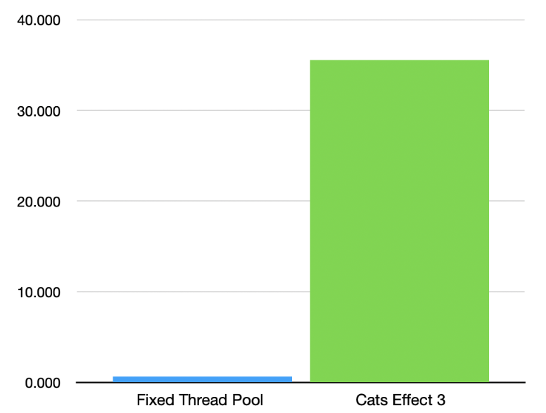
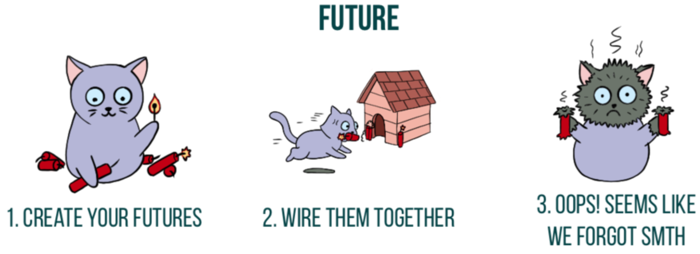
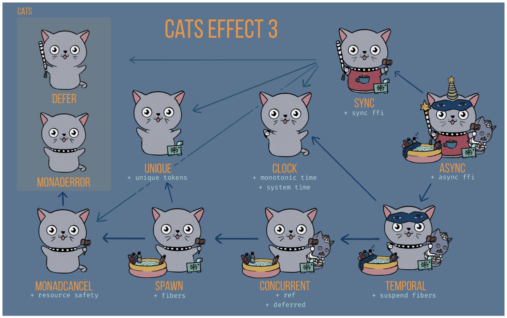
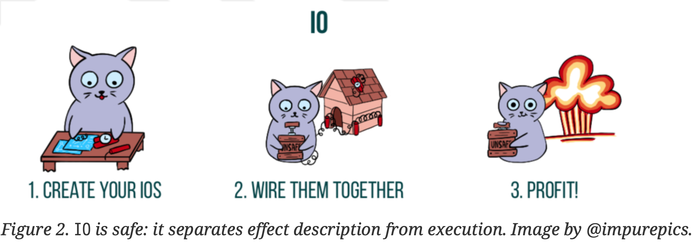

# Cats Effect

公式ドキュメント: https://typelevel.org/cats-effect
Github: https://github.com/typelevel/cats-effect

---

1. Cats Effectとは
2. Resource
3. Threadモデル/Fiber

---

# Cats Effectとは

Cats Effectは、Typelevelが開発したマルチコアを効果的に使用し、リソースをリークさせないコードを簡単に書くことができるライブラリ

高度に並列化されたサービスのような複雑なアプリケーションの構築が、より生産的になる

Cats EffectのIOモナドを使ってプログラムを実装することで、勝手に優れたRuntimeの上にプログラムが乗って、実行環境のことを気にすることなく早いプログラムを実行可能。

---

# 5つのルール

1. すべての副作用をdelay, async, blocking, interruptible/interruptibleMany でラップする。
2. 閉じる必要のあるものには、`bracket`や`Resource`を使用します。
3. ブロッキングまたは割り込み可能以外のスレッドをハードブロックしてはいけない
4. 自分で実行せずにIOAppを使う
5. 名前にunsafeと入っているもので絶対に実行しない

---

# パフォーマンス

java.util.concurrent.Executorsの固定スレッドプールを使って書かれた典型的なアプリケーションとCats Effectを使って実装した同じワークフローを比較して、そのパフォーマンスを測定した結果、約55倍も高速になりました。

---



---

# Future/IO

|     | Future              | IO           |
|-----|---------------------|--------------|
| 評価  | 逐次                  | 遅延           |
| 実行  | ExecutionContextが必要 | IORuntimeが必要 |
| スレッド | ネイティブスレッド | グリーンスレッド |
| サイズ | 1M                  | 150byte      |

---

# Futureの特徴

- 言語の標準ライブラリとして提供されている
- 処理をExecutionContextの実行戦略に従って非同期化する
- 逐次評価
- 実行される処理の結果をメモ化し、再利用された場合も結果が変わらない

---

# IOの特徴

- 参照透過
- 遅延評価
- 実行がend-of-the-world
- Fiberと呼ばれるグリーンスレッドを使用
- スタックセーフなモナド
- 実行環境が優れている
- キャンセル可能

---

# 最初 IOは便利で安全なFutureだと思って使うだけで大丈夫！

---

# Effect Patternとは

1. プログラムがどのような効果/価値をもたらすか
2. 外部に見える副作用が必要な場合、効果の記述は実行と分離されているか

---

# 参照透過

ある式の値をその式の値で置き換えてもプログラムの結果に影響を与えないもの

---

```scala
def plusOne(i: Int): Int = i+1
val x = plusOne(plusOne(12))
```

1. plusOneはInt型の引数をとり、Int型の値を生成するメソッドです。plusOneはInt ⇒ Intという型シグネチャを持ち、「IntからIntへ」「plusOneはIntからIntへの関数」といえる
2. xは値である。plusOne(plusOne(12)) という式を評価した結果として定義されます。

---

> ある式の値をその式の値で置き換えてもプログラムの結果に影響を与えないもの

先ほどのコードを式の値に置き換えていく

---

1. 内側のplusOne(12)をその式の値に置き換える

```scala
- val x = plusOne(plusOne(12))
+ val x = plusOne(12 + 1)
```

<br>

2. 12 + 1 を 13 に置き換える

```scala
- val x = plusOne(12 + 1)
+ val x = plusOne(13)
```

---

3. plusOne(13)をその式の値に置き換える

```scala
- val x = plusOne(13)
+ val x = 13 + 1
```

<br>

4. 13 + 1 を 14 に置き換える

```scala
- val x = 13 + 1
+ val x = 14
```

---

式の値をその式の値で置き換えてプログラムの実行に変化は起きましたか？

```scala
val x = plusOne(plusOne(12))
val x = 14
```

どちらを実行してもxの値は`14`になるはずです。

つまりこのコードは`参照透過`と呼ぶことができます。

---

# 全てのコードを参照透過にできるか？

先ほどのコードは参照透過でしたが、全てのコードを参照透過にして実装することはできるでしょうか？

試しにこのコードを参照透過にしようとするとどうなるでしょうか？

```scala
val x = println("Hello world!")
```

---

コンソールに印刷するprintln関数の戻り値はUnit型です。代入をかけると...

```scala
- val x = println("Hello world!")
+ val x = ()
```

2つとも戻り値の型は同じUnitになります。しかし、実行した場合結果はそれぞれ異なったものになるでしょう。

前者はコンソールに`Hello world!`を表示し、後者は何も表示しません。

---

# つまり

参照透過にできないコードも存在するということ

上記の例以外にもmutableの値への参照や、外部からのデータ受け取り等参照透過にできないコードはたくさん存在します。

---

# 副作用

副作用とは、ある機能がプログラム上のデータを変化させ、それ以降の演算の結果に影響を与えることを指します。
関数でいうと本来計算結果を返すことが目的ですが、その過程で周囲の状態を変化させてしまうこと。

**簡単にいうと同じ様に呼び出しても同じ結果が返ってくるとは限らない処理のこと**

関数型プログラミングでは、原則として副作用が出ないようにプログラミングを行う。

---

# FutureはEffect Patternに一致するか？

最初の特徴であげたこれはどういうことか？

> 実行される処理の結果をメモ化し、再利用された場合も結果が変わらない

<br>

このコードの`twice`を実行するとどういう結果になるか？

```scala
val print = Future(println("Hello World!"))
val twice = print.flatMap(_ => print)
```

---

コンソールに表示された文字列は1つだけでしたよね？

```shell
Hello World!
```

---

# なぜ？

Futureは構築されるとすぐに実行されるようにスケジュールされているからです。そのため、他の「記述的」な操作（flatMapの後続の印刷）が後で起こったとしても、副作用は（ほとんど）すぐに起こります。
だから、printを2回実行することを記述していますが、副作用は1回しか実行されないのです。

なのでFutureの特徴に`逐次評価`があります。

---

仮にこうすれば2回実行されるようになります。

```scala
val twice = Future(println("Hello World!"))
  .flatMap(_ => Future(println("Hello World!")))
```

---

# FutureはEffect Patternに一致するか？

**プログラムがどのような効果/価値をもたらすか**

Futureは非同期の計算を表し、非同期計算が成功した場合、タイプAの値を返す。

<br>

**外部に見える副作用が必要な場合、効果の記述は実行と分離されているか**

Futureは構成された操作の記述の後に実行されるのではなく、構築時に直ちに実行がスケジューリングされる。

したがって、Futureは効果記述と実行を分離しないのでEffect Patternに一致しない。

---



---

# 副作用を伴うが安全なエフェクトって？

Futureとは違い、参照透過でかつ遅延実行なデータ型

---

```scala
case class MyIO[A](unsafeRun: () => A) // 1

object MyIO:
  def putStr(s: => String): MyIO[Unit] =
    MyIO(() => println(s)) // 2

object Printing extends App:
  val hello = MyIO.putStr("hello!") // 3
  hello.unsafeRun() // 4
```

1. 遅らせたい副作用は、関数 unsafeRunとして定義されます
2. 印刷効果のあるputStrは、println関数の実行を遅延させるMyIO値を構築する
3. `hello!`の出力をMyIOの値として記述しています。しかし、まだ実行されていない。
4. 効果を明示的に実行します

```shell
hello!
```

---

# MyIOは参照透過の条件を満たしているか？

1. 値 hello をその定義に置き換える MyIO.putStr("hello!")

```scala
- val hello = MyIO.putStr("hello!")
- hello.unsafeRun()
+ MyIO.putStr("hello!").unsafeRun()
```

<br>

2. MyIO.putStr 式をその定義に置き換える MyIO(() => println("hello"))

```scala
- MyIO.putStr("hello!").unsafeRun()
+ MyIO(() => println("hello!")).unsafeRun()
```

---

3. unsafeRun() 式をその定義に置き換え、評価する。

```scala
- MyIO(() => println("hello!")).unsafeRun()
+ println("hello!")
```

<br>

プログラムの式を式の値に置き換えていくと最終的に`println("hello!")`と同等になりました。

また実行に関しても、明示的に`unsafeRun`を呼び出さない限り実行されません。

MyIOは参照透過でかつ遅延実行なデータ型つまり、Effect Patternであると言えます。

---

# 問題

- スタックセーフではない
- 参照透過や遅延実行をするだけでは、パフォーマンスに変化はない

---

# この問題を解決したのが Cats Effect

- スタックセーフなモナド
- 実行環境を気にすることなくHightパフォーマンスを出せる

---

# Cats EffectのConstructors

- IOは便利モナド
- 特定の機能ごとに取り出して使用することもできる

---



---

# IOはEffect Patternなのか

IOはmapやflatMapなどのメソッドを用いて新しい動作を構成する能力を維持しつつ、副作用を遅延させる方法を持っている

---

ほとんど場合は`IO.delay`を使って副作用をIO値として捉えるようになります。

```scala
def delay[A](a: => A): IO[A]

val helloWorld: IO[Unit] = IO.delay(println("Hello world!"))
```

- この式の評価を遅らせて、（後で）実行されたときにコンソールに Hello world と表示され、値 () が生成されます。
- println(...)を()に変えても`IO[Unit]`の型は変わらない

※ IO.applyはIO.delayのエイリアスです。
これにより、IO.delay(...)の代わりにIO(...)と書くこともできます。

---

`IO.pure`と呼ばれるメソッドも存在するのですが、こちらは遅延評価を行わないものになります。

<br>

試しに以下のような実装を行うとわかりやすい
と思います。

```scala
val test1 = IO.delay(println("Hello world"))

val test2 = IO.pure(println("Hello world"))
```

---

# IOは便利なモナド

IOには様々なメソッドが定義されている。

良く使われる`map`や`flatMap`に`mapN`なども定義されている。

```scala
(IO(12), IO("hi")).mapN((i, s) => s"$s: $i") // "hi: 12"
```

---

`Future`の場合戻り値を使用しない場合でも以下のような書き方をする必要ありました。

```scala
for
  _    <- Future(...)
  id   <- Future(id...)
  list <- Future(list...)
yield ...
```

---

`IO`だとこのように書ける

```scala
for
  id   <- IO(...) *> IO(id...)
  list <- IO(list...)
yield ...
```

---

戻り値を使用しないものが間にあり順番を入れ替えられない場合

```scala
for
  id   <- Future(id...)
  _    <- Future(...)
  list <- Future(list...)
yield ...
```

---

`IO`だとこのように書ける

```scala
for
  id   <- IO(id...) <* IO(...)
  list <- IO(list...)
yield ...
```

---

Bool値がtrueの時だけ実行するというようなメソッドもある

```scala
val str = "Success"
IO.whenA(str == "Success")(IO.println("Success"))
```

---

# IOのエラーハンドリング

---

IOが実行されると引数の例外をスローしてくれる。
引数で`throw`を行う必要はない

```scala
IO.raiseError(new RuntimeException("IO Error"))
```


`delay`で実装を行う場合は、`throw`が必要です。
```scala
IO.delay(throw new RuntimeException("IO Error"))
```

---

エラーが発生した場合に別の処理を行うことも可能です。

```scala
val iOError = IO.raiseError[Int](new RuntimeException("IO Error"))
val handled = iOError.handleErrorWith(_ => IO(12))
```

単に成功した値を提供したい場合は、handleErrorでも可能

```scala
iOError.handleError(_ => 12)
```

---

発生したエラーを別のエラーに差し替えることもできる

```scala
iOError.adaptError(t => new OtherException(t))
```

---

IOはそのままEitherに変換することもできる。
例えば、あるメソッドはIO[Int]を返すようになっているけど、それは handleErrorWithの呼び出しによって生成されたかもしれないですし、中で例外が発生してるかもしれない。

その場合`attempt`というメソッドを使うことでIOの実行をEitherにして返すことができます。

```scala
val attempted: IO[Either[Throwable, Int]] = iOError.attempt
```

---

IOのエラーハンドリングは他にも存在しており何を使えば良いか困ったら以下を参考にしていただければと思います。

---

- エラーごとに処理を変えたい
```scala
onError(pf: PartialFunction[Throwable, IO[Unit]])
```
- エラー発生時に成功した場合の値を返したい
```scala
handleError(f: Throwable => A): IO[A]
```
- エラー発生時に成功した効果の値を返したい
```scala
handleErrorWith(f: Throwable => IO[A]): IO[A]
```

---

- エラーの種類に応じて成功した場合の値を返したい
```scala
recover(pf: PartialFunction[Throwable, A]): IO[A]
```
- エラーの種類に応じて成功した効果の値を返したい
```scala
recoverWith(pf: PartialFunction[Throwable, IO[A]]): IO[A]
```
- エラーの発生を遅らせたい
```scala
attempt: IO[Either[Throwable, A]]
```

---

# IO値の実行

副作用はIO値にカプセル化することで遅延させています。
実行する方法はいくつかありますが、副作用が実行され、置換処理が適用されないことを示すために、すべてに`unsafe`という接頭辞が付けられています。

最もよく遭遇する安全でないメソッドは`unsafeRunSync`です。Run は実行、sync は同期実行を意味し、ともに効果を同期的に実行し、その結果を返します。IO[A] に対して unsafeRunSync を呼び出すと、効果が成功した場合に A タイプの値が生成されます。

---

例えば以下は、値 "hello world!" を生成します。
エフェクトが実行中に例外をスローした場合、または IO.raiseError で直接作成された場合、その例外は unsafeRunSync からスローされます。
```scala
IO("hello world!").unsafeRunSync
```

---

# IOはEffect Patternに一致するか？

**プログラムがどのような効果/価値をもたらすか**

計算が成功した場合、A タイプの値

<br>

**外部に見える副作用が必要な場合、効果の記述は実行と分離されているか**

実行されると、IOは副作用を含め、何でもできるようになる。IO値を各種コンストラクタで記述し、複合効果をmap, mapN, flatMapなどのメソッドで合成して記述する。効果の実行は、unsafe*なメソッドが呼ばれたときのみ行われる。

したがって、IOはEffect Patternに一致する。

---



---

# IOAppによるアプリケーションでのエフェクトの実行

```scala
package sample.effect

import cats.effect.*

object HelloWorld extends IOApp: // 1
  def run(args: List[String]): IO[ExitCode] = // 2
    helloWorld.as(ExitCode.Success) // 3

  val helloWorld: IO[Unit] = IO(println("Hello world!"))
```

1. アプリケーションはオブジェクトである必要があり、IOAppを拡張する必要があります。
2. アプリケーションのエントリポイントは run メソッドであり、run メソッドは以下の値を返す必要がある。 IO[ExitCode]を返します。
3. 実行される計算を宣言する。

---

# まとめ

1. cats.effect.IOは、任意の副作用をカプセル化することができる効果です。
  i. コンストラクタは、純粋な値、遅延した副作用、エラーやFutureのような他の型からIOを生成します。
  ii. コンビネータを使うと、新しいエフェクトを作ったり、その出力を変換したり、エラーを処理したりすることができます。すべてのコンビネータはエフェクトの実行を回避することが重要で、そうしないと置換が破綻します。
  iii. IO[A]の値を実行することができます．その値は，A型の値を生成するか，例外を発生させるかのどちらかです．これらの値は，unsafe-prefixされたメソッドによって，プログラムのごく「端」で実行されるに過ぎません．
2. cats.effect.IOAppは、アプリケーションを実行される1つのIO効果として記述することができます。

---

# 次回以降

次回以降は大きく分けて以下を何回かに分けて話していこうと思います。

- 並列実行
- 非同期
- リソースの管理
- アトミック制御
- Threadモデル

---

# IOは便利で安全なFutureだと思って使うだけで大丈夫！

---

# 業務で使えるScala3の機能 (第1回目)

---

# Context Functions

Context Functionsというのはコンテキストパラメーターを持つ関数のことです。

コンテキストパラメーターというのは`?=>`の矢印とはてなの記号を使って表現してるものです。

---

# implicit Paramater

今まで暗黙的な引数を引き回したい時は以下のような実装を行なっていたと思います。

```scala

def future(...)(implicit ec: ExecutionContext): Future[A] = ???

```

---

Scala3だとこの表現は`using`に変わりました。

```scala
def future(...)(using ec: ExecutionContext): Future[A] = ???
```

`using`だと引数名を明示しなくても実装可能になっています。

```scala
def future(...)(using ExecutionContext): Future[A] = ???
```

---

ただ`ExecutionContext`引き回すところなんてたくさんあるし、都度パラメーター書くのってめんどくさくないですか？

---

Context Functionsだったらこう書ける！
暗黙の引数を型で表現できるようになったわけです。

```scala
def future(...): ExecutionContext ?=> Future[A] = ???
```

---

でもこれってパラメーターを都度書く場合と手間はそんなに変わらないのでは？

---

Context Functionsは暗黙の引数を型で表現できるんです！

つまり？

---

型エイリアスを定義することができるんです。

```scala

type Executable[A] = ExecutionContext ?=> Future[A]

def future[A](...): Executable[A] = ???

```

---

特定のメソッドにだけ暗黙の引数増やしたいってなった場合、型エイリアスだと他にも影響でないの？

そこだけ`using`を使った暗黙のパラメーター書かないといけなくなるんじゃないの？

---

こう書かないといけないんだったらちょっと微妙だよね

```scala
def future[A](...)(using String): Executable[A] = ???
```

---

そんなことしなくても大丈夫。
Context Functionsは複数の組み合わせが可能

```scala
def future[A](...): String ?=> Executable[A] = ???
```

---

Lambda式の場合今までは、このIntを暗黙的に書くことはできませんでした。

```scala
val lambda: Int => String = (int: Int) => int.toString
```

コンパイルでエラーになる

```scala
val lambda: Int => String = (implicit int: Int) => int.toString
```

---

Context FunctionsだとLambda式でも使用可能

```scala
val lambda: Int ?=> String = summon[Int].toString
```

---

# Context Functions導入されて嬉しいものは？

例としてPlay FrameworkのActionにContext Functionsが導入されると何が嬉しいでしょうか？

---

今Actionを使った実装ってこういう感じで実装してますよね。

```scala
def get(...) = Action async {
  ...
}
```

---

もし`request`の値を使いたい場合って、こんな感じで明示的に呼び出して使ったり`implicit`をつけて暗黙的に引き回したりしてますよね？

```scala
def get(...) = Action async { request =>
  ...
}

...

def get(...) = Action async { implicit request =>
  ...
}
```

---

なぜそうしないといけないのか？

実装が以下のようになっているからです。

```scala
final def async(block: R[B] => Future[Result]): Action[B] = ???
```

---

もしこれがContext Functionsで実装された場合何が嬉しいでしょうか？

```scala
final def async(block: R[B] ?=> Future[Result]): Action[B] = ???
```

---

暗黙的に引き回したい場合は、暗黙の引数を受け取るものを中で使うだけで良くなる。

```scala
def hoge(using request: Request[AnyContent]) = ???

def get(...) = Action async {
  hoge
  ...
}
```

---

もし暗黙的じゃなく使用したい場合は、`summon`で呼び出すこともできるし、今までと同じように呼び出すこともできます。

```scala
def get(...) = Action async {
  summon[Request[AnyContent]]
  ...
}
```

```scala
def get(...) = Action async { request ?=>
  ...
}
```

---

# 使い分けはどうしたらいいの？

個人的な使い分けですが、暗黙的に受け取った値を変数として明示的に使いたい場合は`using`、暗黙的に引き回すだけであれば`Context Functions`を使えば良いと思ってます。

明確な決まりがあるわけではないので、好きなように実装すれば良いと思います。
