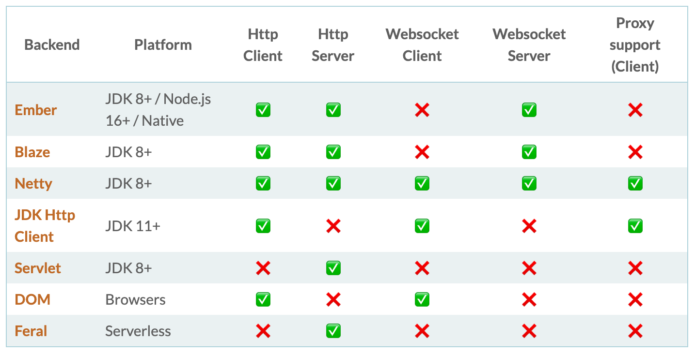

# http4sでのHello World

公式ドキュメント: https://http4s.org/
Github: https://github.com/http4s/http4s

---

# 目的

最初から理解するのは難しいので、最初はこんな感じで書いてアプリケーション作っていくのねえ〜ぐらいの感覚で大丈夫です。

http4を使う上でCats Effectがどのように絡んでくるのかとかも見ていただければと思います。

---
# http4sとは

http4sはtypelevelエコシステムのシンプルなhttp(サーバー、クライアント)ライブラリです。
IO モナドなどのエフェクトライブラリと組み合わせて使います.

---
# サーバー/クライアント

http4sのサーバー/クライアントは以下表にあるものから選んで構築を行うことができます。



---
# サーバー/クライアント
以前までBlazeがメインサーバーでしたが、現在はEmberというものがメインで開発を行っているサーバーになります。

※ サンプルコードや記事ではBlazeServerを使うものが多いですが、最新はEmberServerなので使用する時は注意してください。

---

# 構成

http4はざっくり言うとパスごとに処理を書くサービスと、アプリケーションで実行するサービスをまとめたルーターと、ルーターを受け取りアプリケーションを実行するサーバーで構成されています。

サービス: HttpRoutes
ルーター: Router
サーバー: EmberServer (※ Emberを使用した場合)

---

# 依存関係の追加

依存関係に以下2つを追加します。

```scala
val http4sVersion = "0.23.16"
libraryDependencies ++= Seq(
  "org.http4s" %% "http4s-dsl" % http4sVersion,
  "org.http4s" %% "http4s-ember-server" % http4sVersion
)
```

---

# サービス

http4sのサービスを構築するためのHttpRoutesは、Kleisliの単純なエイリアスです。

```scala
Kleisli[[T] =>> OptionT[F, T], Request[F], Response[F]]
```

KleisliはRequest[F] => F[Response[F]]の便利なラッパーに過ぎず、Fは効果的な操作です。

※ Fは今回Cats EffectのIOを使用しますが、IOに関してはCats Effectの章で説明します。
※ =>> はScala3で追加されたLambda Functionというものです。

---

# Kleisliとは

Kleisliは `A => F[B]` という型の関数に対する特殊なラッパー

- [Catsのドキュメント](https://typelevel.org/cats/datatypes/kleisli.html)
- 圏論的に学びたい人は[こちら](https://criceta.com/category-theory-with-scala/04_Kleisli_category.html)を参照

---

# サービス

HttpRoutesを使用した最小サービス

これはメソッドがGETでパスが`/hello/takapi`の場合、200のレスポンスで`Hello, takapi.`を返すサービスを構築したことになる。

```scala
val helloWorldService = HttpRoutes.of[IO] {
  case GET -> Root / "hello" / name =>
    Ok(s"Hello, $name.")
}
```

---

# HttpRoutes.of[IO]

`of[F[_]: Monad]`メソッドは、部分関数を受け取りそれをHttpRoutesに昇格させるためのメソッドです。

```scala
def of[F[_]: Monad](pf: PartialFunction[Request[F], F[Response[F]]]): HttpRoutes[F] =
  Kleisli(req => OptionT(Applicative[F].unit >> pf.lift(req).sequence))
```

`Applicative[F].unit`は`pf.lift(req).sequence`の結果をFにliftしていると思ってください。

---

# PartialFunctionとは

MapやOptionのcollectメソッドの内部などで使われているもの

Aに対してBを返すような関数ですが、必ずしもタイプAのすべての値を含むとは限らないことに注意

```scala
trait PartialFunction[-A, +B] extends (A) => B
```

つまり、簡単にいうと特定の引数のみ処理する関数。

---

# PartialFunctionとは

普通の関数と同じように呼び出すが、パターンにマッチしない場合はMatchErrorになる。

```scala
val pf: PartialFunction[Int, String] = {
  case 1 => "first"
  ... // 複数定義可能
}

println(pf(1)) // => first
println(pf(2)) // => MatchError
```

---

# PartialFunctionとは

PartialFunctionは合成することができる。

```scala
val pf1: PartialFunction[Int, String] = { case 1 => "first" }
val pf2: PartialFunction[Int, String] = { case 2 => "second" }

// pf1にマッチしない場合はpf2を適用するPartialFunctionを生成
val pf3 = pf1 orElse pf2

println(pf3(1)) // => first
println(pf3(2)) // => second
println(pf3(3)) // => MatchError
```

---

# PartialFunctionとは

`of`メソッドの中で使われている`lift`はPartialFunctionのキーに該当してたらSomeに包んで値を返し、なければNoneを返すメソッド。

```scala
def of[F[_]: Monad](pf: PartialFunction[Request[F], F[Response[F]]]): HttpRoutes[F] =
  Kleisli(req => OptionT(Applicative[F].unit >> pf.lift(req).sequence))
```

---

# HttpRoutes

つまりHttpRoutesの構築は、リクエストを受け取りそのリクエストに一致したものがあればその値(Response)を返す関数だということがわかります。

---

# Requestなんてないやん

ここで最小の実装をもう1度見て見ましょう。

```scala
val helloWorldService = HttpRoutes.of[IO] {
  case GET -> Root / "hello" / name => Ok(s"Hello, $name.")
}
```

これを見てパッと見どれがRequestかわかる人は少ないと思います。

実装は以下のようになっているのですが、ではどれがRequestなのでしょうか？
```scala
final class Request[F[_]] private (
  val method: Method,
  val uri: Uri,
  val httpVersion: HttpVersion,
  val headers: Headers,
  val body: EntityBody[F],
  val attributes: Vault,
) ...
```

---

# Requestなんてないやん

以下画像の赤枠で囲った部分が全てRequestになります。


---

# どういうこと？

なんでこれがRequestになるの？と思ったかもしれません。
なので1つずつ分解していきましょう。

---

# Method -> Path

まずは`->`の部分に関して見ていきます。
これは結論から言うと、RequestをMethodとPathに分解するunapplyメソッドを持った抽出子objectです。

実装は以下のようになっています。

```scala
object -> {
  def unapply[F[_]](req: Request[F]): Some[(Method, Path)] =
    Some((req.method, req.pathInfo))
}
```

※ applyメソッドが引数を取りオブジェクトを作るコンストラクタであるように、unapplyは1つのオブジェクトを受け取り引数を返そうとするものです。

---

# Path / Path

次は`/`の部分に関して見ていきます。
こちらはRequestのPathを細かく分解するunapplyメソッドを持った抽出子objectです。

```scala
object / {
  def unapply(path: Path): Option[(Path, String)] =
    if (path.endsWithSlash)
      Some(path.dropEndsWithSlash -> "")
    else
      path.segments match {
        case allButLast :+ last if allButLast.isEmpty =>
          if (path.absolute)
            Some(Root -> last.decoded())
          else
            Some(empty -> last.decoded())
        case allButLast :+ last =>
          Some(Path(allButLast, absolute = path.absolute) -> last.decoded())
        case _ => None
      }
}
```
---

# Path / Path

`/`は`->`でRequestをMethodとPathに分解した後に、Pathを更に分解するものになります。

---

# unapply x パターンマッチの恩恵を受けずに書くと？

最小サービスの実装をunapply x パターンマッチの恩恵を受けずに書くと以下のようになります。

愚直に書くとなんとなくやってることがわかったんじゃないでしょうか？

```scala
def requestToResponse(request: Request[IO]): IO[Response[IO]] =
  ->.unapply(request) match
    case Some((method, path1)) if method.name == "GET" => /.unapply(path1) match
      case Some((path2, str)) => /.unapply(path2) match
        case Some((_, str1)) if str1 == "hello" => Ok(s"Hello, $str")
        case _ => NotFound("")
      case None => NotFound("")
end requestToResponse

val helloWorldService = HttpRoutes.of[IO] {
  case request => requestToResponse(request)
}
```

※ 本来はもっと条件分岐が必要になってきます。

---

# unapply x パターンマッチの恩恵を受けずに書くと？

愚直に書くととても実装が長くなってしまいますが、unapplyはパターンマッチで扱えるのでここにScalaの強力な型が組み合わさって、以下のようにとても少量のコードで同じような実装が実現できるのです。

```scala
val helloWorldService = HttpRoutes.of[IO] {
  case GET -> Root / "hello" / name => Ok(s"Hello, $name.")
}
```

---

# つまり

http4sにはこのようにRequestに対しての抽出子オブジェクトが複数存在しています。

Requestに対しての抽出子オブジェクトを用意し、unapplyメソッドの1つのオブジェクトを受け取り引数を返そうとする特性を利用して、Requestのメソッドがなんなのかとパスがなんなのかをパターンマッチしているのです。

---

# ルーター

---

# サーバー

---

# サービスの構築

---

# ルーターの構築

---

# サーバーの構築

---

# IOAppでの実行

---

# まとめ
